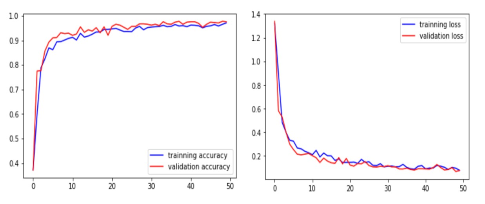

# Driver Drowsiness Detection Using Keras
Python • [Drowsiness_dataset,](https://www.kaggle.com/datasets/dheerajperumandla/drowsiness-dataset) [Sample](https://www.kaggle.com/datasets/shreyamgupta/sample)
> This trained model classifies images based on eye-state (open or closed) & mouth-state (yawning or not yawning) as either indicating drowsiness or alertness.

## Training results:

